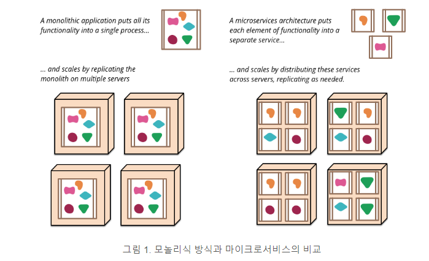
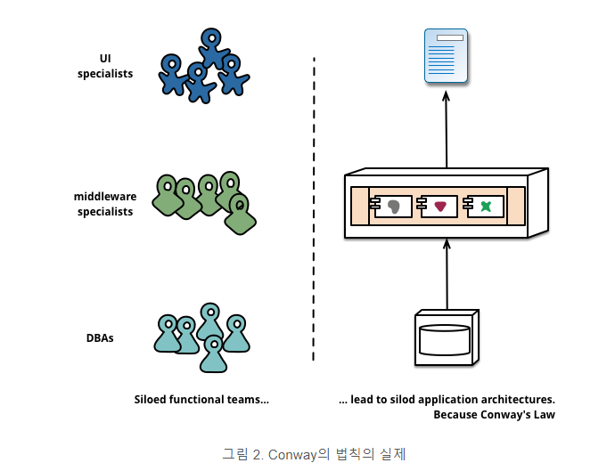
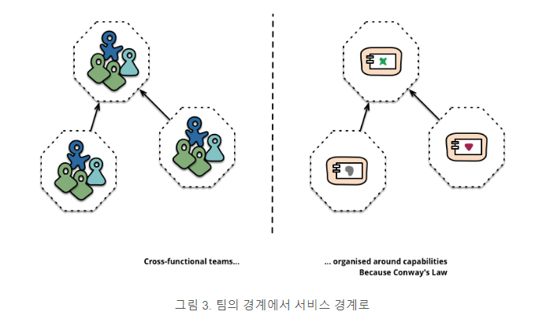

시작하기 전 이 글은 [여기](http://channy.creation.net/articles/microservices-by-james_lewes-martin_fowler#fn-a4158f7f)
에서 가져온 글입니다.

# 마이크로 서비스 아키텍쳐

> "마이크로서비스 아키텍처" 라는 용어는 소프트웨어 응용 프로그램을  독립적으로 배치 가능한 조합으로 설계하는 방식으로서 지난 몇 년 동안 
빠르게 자리잡아 ㄱ가고 있습니다. 본 아키텍처 스타일에 대해 아직 명확한 정의는 없지만, 비지니스 수행과 관련된 조직, 배포 자동화, (서비스)엔드 포인트의 지적 능력, 그리고 프로그래밍 언어와 데이터의 분산 제어에 관한 일반적인 특징들은 존재합니다. <br>2014년 3월 25일


# 목차
+ 마이크로서비스 구조의 특징
    + 서비스로서의 컴포넌트화
    + 비지니스 수행에 따른 구성
    + 프로젝트가 아닌 제품
    + 똑똑한 엔드포인트와 더미 파이프
    + 분산화 거버넌스
    + 분산화된 데이터 관리
    + 인프라 자동화
    + 장애 방지 설계
    + 진화하는 설계
+ 마이크로서비스의 미래


"마이크로 서비스" - 요즘 다양한 소프트웨어 아키텍처가 유행하는데 추가된 새로운 용어입니다.<br> 뭔가 새로운 것을 거부하려는 것이 자연적인 반응이겠지만, 이 용어는 점점 매력적인 최근 소프트웨어 시스템 스타일 사례를 설명하고자 하는 것입니다.<br> 몇 년간 이런 스타일의 프로젝트를 많이 봐 왔으며, 그 결과는 지금까지 매우 성공적입니다.<br> 그래서 우리 동료들이 엔터프라이즈 응용 프로그램을 구축하기 위한 기본 스타일로 사용중입니다. <br>그런데, 안타깝게도 마이크로서비스가 무엇인지, 어떻게 하면 좋은 것인가 하는 것에 대한 개요를 설명하는 정보는 많지 않습니다.


간단하게 말하면, 마이크로서비스 아키텍처 스타일은 단일 응용 프로그램을 나누어 작은 서비스의 조합으로 구축하는 방법이며, 각 개별 서비스는 자신의 프로세스에서 실행하는 HTTP기반 API등으로 가벼운 연결 방식을 사용합니다.<br> 각 서비스는 비지니스 로직의 수행 기능에 맞게 구축 된 완전히 자동화 된 머신에 의한 배포를 통해 이루어 집니다.<br> 각 서비스의 최소한의 중앙 관리 기능은 있지만, 서로 다른 프로그래밍 언어에 의해 개발되고, 다른 데이터 저장 기술을 이용할 수 있습니다.

# 모놀리식

마이크로서비스에 대해 설명함에 있어 모놀리식 스타일과 비교하는 것이 효과적입니다. <br>모놀리식 응용 프로그램은 하나의 큰 덩어리 단위로 구축합니다. <br>엔터프라이즈 응용프로그램은 종종 세가지 주요 부분으로 구성됩니다.
- 클라이언트 측의 UI(HTML 페이지와 사용자 단말기의 브라우저에서 실행되는 Javascript)

- 데이터베이스(공통으로 사용되며 일반적으로 관계형 디비의 다수 테이블로 구성)

- 서버 측 응용프로그램

서버 사이드 애플리케이션은 HTTP요청을 받아 도메인로직을 실행하여 데이터베이스에서 업데이트 된 데이터를 추출한 뒤, 고객 브라우저로 HTML로 만들어진 뷰를 생성하고 전달합니다. 이 서버사이드 애플리케이션은 대부분 하나의 논리적인 실행 파일입니다. 시스템에 대한 변경이나 서버 측 응용프로그램이 바뀌면 완전히 새로운 버전을 컴파일해서 배포하게 됩니다.

이러한 모놀리식한 구조는 이런 시스템을 구축하는 방법으로 자연스러운 것입니다.<br>
요청을 처리하는 로직은 모두 단일 프로세스로 처리 된 응용 프로그램에서 수행하고, 클래스 및 함수, 네임스페이스로 분할하는 프로그래밍 언어의 기본 기능을 이용합니다.<br>
자세히 살펴보면, 응용프로그램을 개발자 컴퓨터에서 실행 및 테스트를 진행하고<br>
이러한 테스트를 완료하면 실 서버로 배포가 가능한지 확인하는 배포 파이프라인을 사용합니다.<br>
이러한 단일 어플리케이션은 일반적으로 로드밸런서 뒤에 여러 (서버)인스턴스에서 실행하고, 확장할 수 있습니다.

일반적으로 모놀리식 응용 프로그램은 잘 작동하지만 서서히 문제가 발생하게 됩니다.<br>
클라우드에 애플리케이션을 점점 많이 배포하는 경우 특히 그렇습니다.<br>
특히, 배포 주기를 늘리는 것이 점점 어려워집니다.<br>
응용 프로그램 내 작은 부분에 대한 변경이 있더라도, 모놀리식 방식은 모두 빌드해서 다시 배포해야 합니다.<br> 시간이 지남에 따라 모듈 구조를 문제없이 유지하는 것이 점점 어려워지고, 각 모듈의 변경사항을 그 모듈에만 한정하는 것도 어려워 집니다.<br>
서버 확장성도 자원을 더 필요로 하는 부분만 아니라 전체 응용프로그램의 규모에 따라 더 필요해지게 됩니다.



이러한 문제로 인해 마이크로서비스 아키텍처 스타일을 도입하게 됩니다.<br>
즉, 큰 응용프로그램을 여러 작은 서비스의 조합으로 구축하는 것입니다. 각 서비스는 독립적으로 배치 가능하고 확장 가능할 뿐 아니라 서로 다른 프로그래밍 언어로 개발된 다른 서비스임에도 불구하고 명확한 모듈 상의 경계를 가지고 있습니다.<br>
또한, 각 서비스는 그것을 만든 다른 팀들이 직접 관리할 수 있습니다.

우리는 마이크로서비스 스타일이 새롭거나 혁신적인 것이라 생각하지 않지만 적어도 유닉스의 설계 사상을 근본으로 두고 있음을 말하고 싶습니다.<br>
아직 마이크로서비스를 충분히 고려하고 있지 않다고 생각하고, 많은 소프트웨어 개발자들이 마이크로서비스 방식을 활용함으로써 더 나은 서비스를 만들 수 있기를 바랍니다.

# 마이크로서비스 구조의 특징

앞서 말한대로 마이크로서비스 아키텍처 스타일의 정확한 정의는 없지만, 마이크로서비스에 대한 일반적인 특징을 나열 해 볼 수는 있습니다.<br>
일반적인 특징을 나열한다고해서 모든 마이크로서비스가 다 가지고 있는 특징은 아니라는 점도 밝혀둡니다.<br>
하지만, 대부분 마이크로서비스 아키텍처가 이러한 특징을 가지고 있다고 예상합니다.<br>
우리가 다소 느슨한 커뮤니티보다는 더 활동적인 사람들이기는 하지만, 이 글의 원래 의도는 우리가 해온 일과 우리가 아는 팀들이 해온 일을 좀 더 잘 설명하기 위한 것이며, 아래 사항들이 따라야할 무엇인가를 규정하고 있는 것은 아닙니다.

## 서비스를 통한 컴포넌트화

소프트웨어 산업에서는 오랫동안 구성요소를 나누고 이를 연결하는 시스템을 구축해왔습니다.<br>
이것은 자연계에 존재하는 일반적인 생각과 똑같은 원리입니다.<br>
최근 10~20년 동안 우리는 대부분의 개발 언어 환경의 공통 라이브러리의 놀라운 발전을 보아 왔습니다.<br>
구성요소에 대해 논의할 때, 무엇이 구성요소를 만드는가 하는 것을 정의하는 것은 어렵습니다.<br>
그래서, 간단하게 우리는 구성 요소를 독립적으로 대체하거나 업그레이드 가능한 소프트웨어 단위로 정의하겠습니다.

마이크로서비스 역시 라이브러리를 사용하지만, 각 소프트웨어 자체를 컴포넌트화하는 첫 번째 방법은 여러 서비스로 분리하는 것입니다.<br>
우리는 라이브러리를 프로그램에 링크되어 메모리 내 함수 호출을 사용하는 구성요소로 정의합니다.<br>
이것은 서비스가 웹서비스 요청 또는 RPC와 같은 통신 외부 프로세스 구성요소인 것과는 대조적입니다.(이 정의는 많은 객체 지향 프로그램의 서비스 객체의 개념과는 다른 것입니다.)<br>

(라이브러리가 아닌) 구성 요소로서 서비스를 정의하는 주요 이유 중 하나는 각 서비스가 독립적으로 배치 가능하기 때문입니다.<br>
만약 단일 프로세스 내에 다중 라이브러리에 의해 응용 프로그램을 구성하는 경우, 각 구성 요소의 변경으로 인해 전체 응용프로그램의 재배포가 필요합니다.<br>
하지만, 응용 프로그램이 여러 서비스에 분해되어 있을 경우 다수의 서비스가 각각 변경되는 경우에는 해당 서비스의 재배포만 필요합니다.<br>
물론 이것은 절대적인 것이 아니며, 약간의 변화만 있으면 각 서비스 인터페이스도 조금씩 바뀔 수는 있습니다. <br>
하지만, 결국 마이크로서비스 아키텍처의 목적에 맞는 적합한 서비스 경계를 만들어서 앞으로 서비스 사이의 약속을 보장하면서 진화해 나갈 것 입니다.

컴포넌트로서 서비스를 사용하면 각 구성요소의 인터페이스가 보다 명시적이 된다는 점도 중요합니다.<br>
대부분의 프로그래밍 언어는 명시적인 공표된 인터페이스를 정의하는데 효과적인 메커니즘을 가지고 있지 않습니다.<br>
클라이언트가 구성요소 캡슐화를 파괴하는 것을 방지하기 위해서는 기술 문서나 내부 코딩 규칙에 의존해야 하고, 결국 구성요소간의 결합도를 지나치게 높이는 결과를 가져옵니다.<br>
각 서비스는 명시적인 원격 호출 메커니즘을 이용하여 이러한 종속과 결합을 방지하는데 도움을 줍니다.

이와 같은 서비스를 만드는데 따른 부정적인 측면도 분명히 있습니다.<br>
원격 호출은 프로세스 내부 호출보다 비용이 높기때문에 원격 API는 각 구성요소를 크게 나누는 경향이 있습니다.<br>
사용하기 어려울 뿐 아니라 만약 구성요소간의 책임 할당을 변경할 필요가 있는 경우, 이러한 변화는 프로세스 경계를 넘는 경우 더욱 힘든 일이 될 것입니다.

첫번째 시제품으로 서비스를 런타임 프로세스에 매핑 할 수 있을것 같지만, 어디까지나 그것은 시제품입니다.<br>
따라서, 서비스는 응용프로그램 프로세스 및 서비스에서만 사용되는 데이터베이스와 함께 배포되는 다중 프로세스로 구성할 수 있습니다.


## 비지니스 수행에 따른 구성

거대한 응용 프로그램을 분할하는 경우에 볼 수 있는 흔한 관리 방식은 기술적 계층에 초점을 맞추어 UI팀, 비지니스 로직팀, 그리고 데이터베이스 팀과 같이 편성하는 것입니다.<br>
이러한 사고방식에 따라 각 팀을 분리할 때, 단순한 변경이 필요한 경우라도 리소스 및 예산 승인에 시간이 걸리고 자칫 많은 팀간 협업을 해야하는 커다란 프로젝트 규모가 될 수 있습니다.<br>
현명한 팀은 이런 일을 최적화하고 더 나은 방법을 지향합니다.
즉, 변경이 필요한 으용 프로그램 안에 모두 로직을 넣는 것이니다. 즉, 비지니스 로직을 어디서나 포함 시킵니다. 이것은 Conway의 법칙에 따라 행동한 예입니다.

> 일반적으로 정의되는 시스템을 설계하는 어떤 조직도 자신의 조직이 가진 커뮤니케이션 구조를 복제하는 아키텍처 디자인을 만들어낸다. -Melvyn Conway 1967



마이크로서비스의 접근방식은 비지니스 수행 능력에 따라 정리된 서비스로 나눈다는 점이 조금 다릅니다.<br>
물론 각 서비스는 비즈니스 영역에 해당하는 소프트웨어 스택 구현을 광범위하게 포함 할 수 있습니다.<br>
즉, 사용자 인터페이스, 영구 스토리지, 외부 연계 등입니다.<br>
이에 따라 각 팀은 상호 기능적이며, 개발을 위해 필요한 모든 범위의 기술을 포함 할 수 있습니다. - 사용자 체험, 데이터베이스, 프로젝트 관리 등등



이러한 방법으로 조직된 기업으로  [comparethemarket.com]( https://www.comparethemarket.com/) 를 들 수 있습니다.<br>
각자 상호 기능형 팀은 각 제품을 구축 및 운용할 책임을 가지고 각 제품은 메시지 버스(Bus)를 통해 통신하는 여러 독립적인 서비스로 분할 되어 있습니다.<br>

물론 거대한 모놀리식 응용 프로그램도 사업 수행 능력에 따라 모듈화 할 수 있습니다.<br>
하지만, 우리는 모놀리식 애플리케이션을 구축하는 거대한 팀을 비지니스 항목에 따라 분할하도록 권장하고 있습니다.<br>
우리가 주목하고 있는 문제는 회사들이 맥락(context)에 따라 너무 많은 조직을 구축하는 경향이 있다는 것입니다.<br>
만약 모놀리식 방식이 다수의 모듈 경계를 넘는 경우, 팀의 개별 구성원들의 단기 기억에 의존해야하는 어려움이 있습니다.<br>
또한, 모듈 경게를 이해하기 위해 강제적으로 많은 교육이 필요하다는 것을 경험했습니다.<br>
명시적인 서비스 구성 요소에 의해 분할 함으로서 명확한 팀 경계를 유지하는 것이 더 쉽습니다.

### 마이크로서비스의 크기

```
마이크로서비스가 유명한 아키텍쳐 스타일이 되었다해도 용어 자체가 서비스의 크기에 초점을 맞추지 않고 "마이크로"라는 단어 때문에 계속 논쟁이 있을 수밖에 없습니다. 마이크로서비스를 해본 사람들도 그 범위가 넓다는 것을 인정합니다. 가장 큰 규모는 Amazon에서 밝힌 Two Pizza Team(이상적인 팀의 크기는 피자 두판으로 한끼를 떼울 수 있는 규모) 즉, 12명을 넘지 않는다는 것입니다. 우리가 본 제일 작은 팀은 6개의 서비스를 지원하는 6명의 팀입니다.
서비스별로 12명이 필요한지, 서비스별로 한명만 있으면 되는지 또 다른 의문을 만들어 냅니다. 현재로서는 어떤 팀이라도 마이크로서비스를 가능하게 하면서 더 발전할 수 있는 마인드로 함께 변화하는 것이 중요합니다.
```

다음 포스팅에서 계속